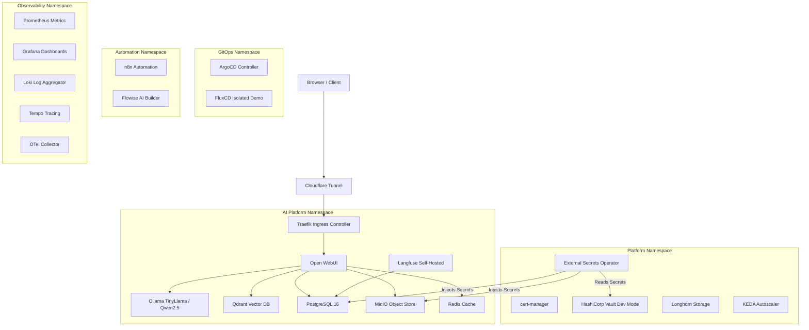

# Self-Hosted AI Platform Architecture

## Architecture Overview

This platform is a zero-cost, GitOps-managed self-hosted AI platform designed to run on a local Kubernetes cluster (k3s) on an 8GB RAM Linux machine without Docker.

## Namespace Layout & RAM Allocation

| Namespace | Components | Memory Request | Memory Limit |
|---|---|---|---|
| `platform` | cert-manager, external-secrets, vault, longhorn, keda | 320Mi | 640Mi |
| `gitops` | argocd | 256Mi | 512Mi |
| `observability` | prometheus, grafana, loki, tempo, otel-collector | 704Mi | 1.4Gi |
| `ai-platform` | ollama, open-webui, qdrant, redis, postgres, minio, langfuse | 1.25Gi | 2.5Gi |
| `automation` | n8n, flowise | 256Mi | 512Mi |

## Key Design Principles
1. **Containerd Native**: Runs directly on k3s containerd runtime without Docker dependencies.
2. **Strict Memory Limits**: Hard memory ceilings per container ensure cluster fits within 3-3.5GB RAM.
3. **No LoadBalancers**: Uses `ClusterIP` + Ingress only to guarantee $0 cost.
4. **GitOps Single Source of Truth**: All manifests version controlled and managed via ArgoCD.
